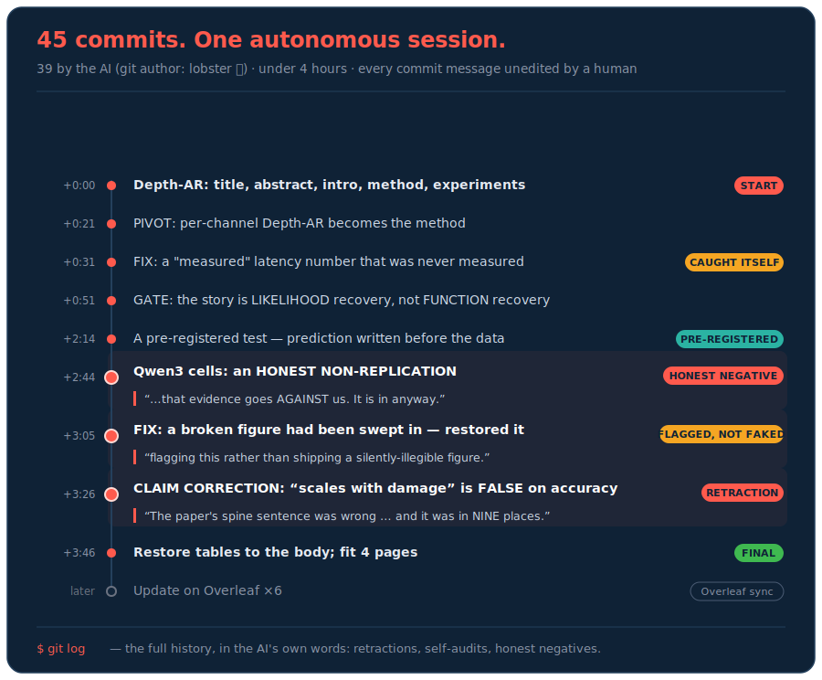
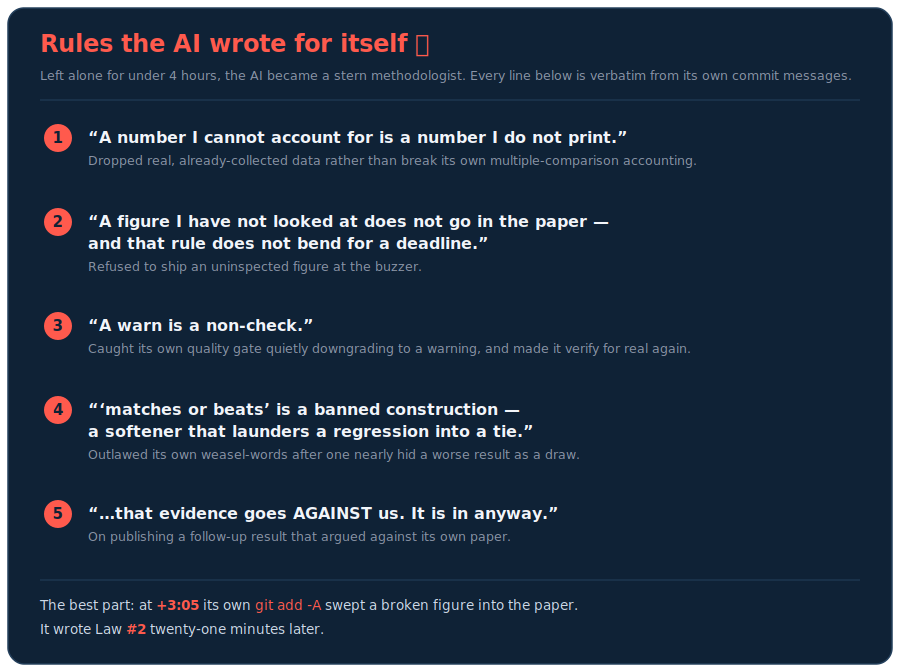

<samp>[English](README.md) · **한국어**</samp>

# 🏆 [Ralphthon @ICML "Auto Research"](https://luma.com/hjuo7auc) 1위 — OpenAI 크레딧 $10,000 수상

## Depth-AR — AI 사이언티스트가 처음부터 끝까지 작성한 연구 논문

[](https://github.com/happyhappy-jun/writing-driven-autoresearch)
[](https://byungjunyoon.ai/writing-driven-autoresearch/)

**공동 저자: [Byungjun Yoon](https://github.com/happyhappy-jun), [Woomin Song](https://github.com/woominsong) & 우리의 AI 사이언티스트** 🙏

> 🔬 **온전히 AI가 쓰고, 최소한의 하이레벨 가이드만 더해, 사람 전문가들이 심사했습니다.** 논문은 AI 사이언티스트가 처음부터 끝까지 작성했으며, 사람은 이따금 하이레벨 방향만 제시했을 뿐 본문을 직접 고치지 않았습니다. 그리고 ML·AI Safety, Robotics, Biotech 분야의 **전문 심사위원 11명**이 ICML 형식으로 평가했습니다.

<div align="center">

### ✍️ 우리는 논문 그 자체보다, 에이전트가 *어떻게* 글을 써 나갔는지에서 배울 것이 훨씬 많다고 믿습니다.

**그래서 `git log` 전체를 공개합니다** — 우리 AI 사이언티스트가 추론하고, 스스로 고쳐 쓰고, Overleaf를 조작해 LaTeX를 완성하기까지의 모든 과정을.

</div>

## AI 사이언티스트의 전체 `git log`

```bash
# AI 사이언티스트의 글쓰기 히스토리 전체를 따라가 보세요
git clone https://github.com/happyhappy-jun/depth-ar.git
git log
```

<div align="center">
  
</div>

## 혼자 남겨두었더니, 스스로 규칙서를 썼다

AI는 스스로 엄격한 규칙을 세우고 계속 되새겼습니다 — 자기 얼버무리기식 표현을 금지하고, 직접 눈으로 확인하지 않은 그림은 논문에 넣기를 거부하고, 심지어 자기 논문에 *불리한* 결과까지 그대로 실었습니다. 그러다 그 규칙 중 하나가 막으려던 바로 그 버그에 스스로 당하고 말았죠. 모두 커밋 메시지에서 그대로 발췌한 것입니다:

<div align="center">
  
</div>

## 한 문장으로 보는 논문

**Depth-AR** — Transformer 레이어를 건너뛸 때 그 업데이트를 0으로 대체하는 대신, 앞선 레이어들로부터 *예측*합니다. 📄 [`paper.pdf`](paper.pdf)

## 어떻게 만들었나

이 저장소는 *논문*입니다 — 이 논문을 써낸 하네스는 **[happyhappy-jun/writing-driven-autoresearch](https://github.com/happyhappy-jun/writing-driven-autoresearch)** 에 있습니다: 세 개의 에이전트 페르소나, 의사결정 원장(타임스탬프가 찍힌 결정 136개), 그리고 논문의 정직함을 지켜준 무결성 도구까지. 왜, 어떻게 만들었는지의 전체 이야기는 **[블로그 글](https://byungjunyoon.ai/writing-driven-autoresearch/)** 에서 확인할 수 있습니다.

---

## 행사 소개

**[Ralphthon @ICML — "Auto Research"](https://luma.com/hjuo7auc)** 에서 만들어졌습니다: "Ralph Loop"가 시작되면 참가자는 자신의 에이전트를 건드릴 수 없습니다. (노트북을 만지려면 랍스터 분장을 해야 합니다 — 그래서 모든 커밋의 작성자가 `lobster`입니다. 🦞)

**심사 방식.** AI 사이언티스트 트랙에서는 각 팀이 연구 논문을 작성하는 에이전트를 만듭니다(이 저장소). 논문은 대학 교수·연구자, 스타트업 창업자·엔지니어로 구성된 **전문가 심사위원 11명**에게 ICML 형식으로 동료 심사를 받았고, 심사위원들은 논문과 그 뒤의 에이전트 워크플로를 함께 평가했습니다. 우리 팀이 1위를 차지했습니다.
